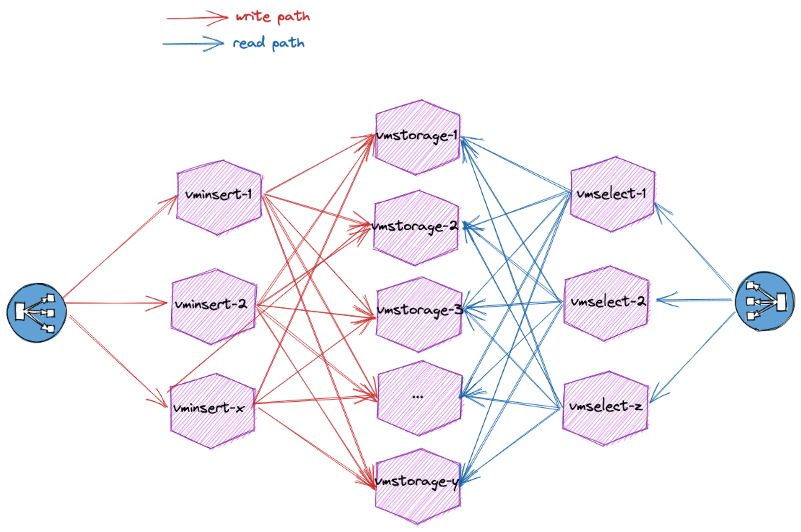

# Remote storage wars

This is a little pet project to learn a few things about terraform and the challenges brought by time-series management at scale. At first only TimescaleDB was on the radar but what got me really starting is the [following tweet](https://twitter.com/cevianNY/status/1339955888870797314) and timescale/promscale#391. Not all remote storage for Prometheus are made equal and it's far from easy to pick the one which is best suited for your use case.

Let's put them in the same infrastructure and see where it get's us, just for fun... Or not.

## Disclaimer

You should expect to have breaking changes or partly working stuffs often as this is a learning playground. I would not recommend to put this project in (real) production.

## Targets

On top of learning a few thing about time-series and generally cloud technologies, we will try to challenge each backend to see how much we can rely on it. This is a vast topic, it imply cost, performance, scalability, reliability and so on.

### Architecture

Throughout this project we will be building an infrastructure around Prometheus' remote storage.
The generic infrastructure contains:
* A couple of node_exporter who only purpose is to expose data to be scraped
* Several prometheus (clusterd or not) who will be responsible for scraping the node_exporter and performing remote_write to the remote storage
* Grafana because we love dashboards
* Consul for service discovery and k/v store.

Here is what the infrastructure looks like:


[Promscale](https://github.com/timescale/promscale) remote storage is similar to the following drawing:


[Cortex](https://github.com/cortexproject/cortex) remote storage is similar to the following drawing:


[VictoriaMetrics](https://github.com/VictoriaMetrics/VictoriaMetrics) remote storage is similar to the following drawing:


### Hachimon

To make it a bit more fun, we will walk on the [hachimon path](https://naruto.fandom.com/wiki/Eight_Gates):
* Gate of Opening
  * 1k targets
  * 1000 series/target
  * ~ 66k datapoints/sec
* Gate of Healing
  * 2k targets
  * 1000 series/target,
  * ~133k datapoints/sec
* Gate of Life
  * 4k targets
  * 1000 series/target
  * ~266k datapoints/sec
* Gate of Pain
  * 4k targets
  * 1000 series/target
  * ~266k datapoints/sec after deduplication
  * dual prometheus to increase pressure on deduplication features
* Gate of Limit
  * 4k targets
  * 2500 series/target to increase pressure on storage
  * ~660k datapoints/sec
  * dual prometheus
* Gate of View
  * 8k targets
  * 2500 series/target
  * ~1.3M datapoints/sec
  * dual prometheus
* Gate of Wonder
  * 10k targets
  * 2500 series/target
  * ~1.6M datapoints/sec
  * dual prometheus
* Gate of Death:
  * Add as many targets as you can until the backend almost reach death

Each Prometheus cluster will scrap many time the same node exporter under a different set of labels. Doing so will allow us to emulate an infrastructure bigger than it is. To increase the cardinality we can tweak node_exporter configuration to expose more or less series. By deploying one or more Prometheus clusters we can both stress the deduplication feature of the backend and workaround the hardware limitation of a given prometheus.

## Requirements

* [Terraform >= 0.15.0](https://www.terraform.io/downloads.html)
* [Packer >= 1.7.0](https://learn.hashicorp.com/tutorials/packer/getting-started-install)
* [Terragrunt >= 0.29.1](https://terragrunt.gruntwork.io/docs/getting-started/install/)
* [Pipenv >= 2020.11.15](https://pipenv.pypa.io/en/latest/)
  * with Python 3.6+
* [Openstack provider](https://www.ovhcloud.com/en/public-cloud/)
  * with compute (Nova) and objects storage (Swift) capabilities
* [OVHcloud account](https://www.ovhcloud.com/en/) (optional for DNS record only)

## Getting started

Once all requirements have been installed you can start playing with everything. Along this project we will deploy and configure:
* [Consul](https://www.consul.io/) for service discovery
* [Prometheus](https://prometheus.io/) for metrics pulling and monitoring
* Several instances to emulate a large infrastructure (scraped many time per Prometheus)
* Several [Prometheus remote storage](https://promlabs.com/promql-compliance-tests/) for comparaison
  * Clustered [VictoriaMetrics](https://docs.victoriametrics.com/Cluster-VictoriaMetrics.html)
  * [Promscale](https://github.com/timescale/promscale) with a [distributed TimescaleDB](https://docs.timescale.com/latest/getting-started/setup-multi-node-basic) running on a [clustered](https://github.com/zalando/patroni) PostgreSQL 13
* [Loki](https://grafana.com/oss/loki/) for logs gathering
* [Grafana](https://grafana.com/oss/grafana/) for dashboarding

### Configure Openstack client

Terraform, Terragrunt, Packer and Ansible rely on Openstack's API, have a look at [Openstack documentation](https://docs.openstack.org/os-client-config/latest/user/configuration.html) on how to configure it properly can be found here.

The simplest way is to have a `clouds.yaml` which can be located in the current directory, `~/.config/openstack` or `/etc/openstack`. Another solution can be to use environment variables as they are supported by all three tools. You can retrieve either `clouds.yaml` or `openrc.sh` from [Horizon](https://docs.openstack.org/horizon/latest/). Alternatively you can mix all solutions but you need to watch out for undefined setting otherwise you will end up with errors.

#### Caveats

Make sure to have Openstack configuration correctly in place otherwise you will end up with error. In the following example `Packer` does not know how to authenticate to Openstack's API.
This information is correctly configured in `clouds.yaml` but this file can contains several configuration, it is also important to set the environment variable `OS_CLOUD`.

```
❯ env | grep -c OS
0
❯ packer build  .
Error: 1 error(s) occurred:

* Missing input for argument [auth_url]

  on debian-10-tsdb-infra-generic.pkr.hcl line 1:
  (source code not available)

==> Wait completed after 7 microseconds

==> Builds finished but no artifacts were created.
```

Here it is something similar but with the Openstack CLI.

```
❯ openstack flavor list
Missing value auth-url required for auth plugin password
```

### Terragrunt

Terragrunt relies on a swift backend. Once you have the necessary in place (e.g: credentials) make sure to have the correct environment variable in place.

```
export OS_REGION_NAME="XXX"
export OS_CLOUD="XXX"
terragrunt init
```

Alternatively you can source `openrc.sh` which should be provided to you by your Openstack provider.

Graph [dependencies between modules](https://terragrunt.gruntwork.io/docs/features/execute-terraform-commands-on-multiple-modules-at-once/#dependencies-between-modules):

```
terragrunt graph-dependencies | dot -Tsvg > graph.svg
```

### Create your virtual environment

From the root directory you simply need to run `pipenv install`. Example:

```
❯ pipenv install
Installing dependencies from Pipfile.lock (489b91)...
  🐍   ▉▉▉▉▉▉▉▉▉▉▉▉▉▉▉▉▉▉▉▉▉▉▉▉▉▉▉▉▉▉▉▉ 0/0 — 00:00:00
To activate this project's virtualenv, run pipenv shell.
Alternatively, run a command inside the virtualenv with pipenv run.
```

This will install all Python packages needed to deploy the infrastructure. All of them are related to Ansible, you can also install them manually and/or globally.

### Build your image

In order to include common settings across all instances we build our own image based on `Debian 10`. For this matter we rely on [Packer Ansible Local Provisioner](https://developer.hashicorp.com/packer/plugins/provisioners/ansible/ansible-local).
The definition on how the image is built is under [packer-boxes](packer-boxes/). The build is quite straight forward, it will:
* Spawn an small Debian 10 instance attached to public network
* [Install a recent version of Ansible](https://docs.ansible.com/ansible/2.9/installation_guide/intro_installation.html#installing-ansible-on-debian)
* Execute a [playbook responsible](playbook/common.yml) for the general setting and installation


### Deploy the infrastructure

Terraform is used for deploying all resources. Most variables can be overwritten in **override.tfvars**. You need to at least define:
* **cloud**: name of the *cloud* to use from *clouds.yaml*.
* **region_name**: The region of the OpenStack cloud to use.
* **ssh_ingress**: list of CIDRs to allow for ssh incoming connexion.
* **ui_ingress**: list of CIDRs to allow for UI incoming connexion.
* **private_network**: name of the private network to create and use for servers.
* **ssh**: ssh information to log in the remote machine.

Review the plan and apply:
```
❯ terragrunt run-all plan | grep Plan
Plan: 71 to add, 0 to change, 0 to destroy.
```

You might also have a look at the flavor instances definition and pick one from [this list](https://www.ovhcloud.com/en/public-cloud/prices/) or by using Openstack's CLI.
```
❯ openstack flavor list | \grep -Ev 'flex|win'
```

Terragrunt & Terraform will deploy everything (network, security groups, instances...) and wait for everything to be up and running. Once completed you can move on to the bootstrap with Ansible part.

### Bootstrap with Ansible

For this part you will need to execute all commands from the virtual environment created with `pipenv`. This can be done using `pipenv shell`.
Be sure to be **in** the virtual environment in the [playbook directory](playbook/) for everything related to Ansible.

The first time you will need to pull all roles and collections from [Ansible Galaxy](https://galaxy.ansible.com/).

```
ansible-galaxy collection install -r requirements.yml
ansible-galaxy install -r requirements.yml
```

Once all Ansible's requirements have been installed and the infrastructure deployed and reachable, launch the bootstrap playbook:

```
❯ ansible-playbook site.yml
```

### May the war began

With everything up and running it's now possible to start comparing our tsdb and fine tune our Prometheus.
As of now Prometheus is responsible for gathering all metrics and write them in all tsdb.
Increasing the number of target or series per target increase the pressure on Prometheus and the tsbs. While being in front of the tsbs and eventually a bottleneck, it's still interesting to see how to tune Prometheus. In a context where we were to offer of PromQL compatible remote storage we still need this experience. It is equally interesting to do the same comparaison without Prometheus.

To increase pressure Prometheus is configured to scrape [fake targets](playbook/group_vars/meta-subrole_prometheus/bench.yml). Those fake targets are actually the `tsbs` instances load balanced using a [file-sd-config](playbook/templates/bench-file-sd-config.yml.j2). As such, you can overwrite the default configuration with a file under `playbook/group_vars/meta-subrole_prometheus/x-bench-overwrite.yml`. Apply [prometheus playbook](playbook/prometheus.yml), rince and repeat.

It is also possible to generate fake labels to increase cardinality.

All series are available in Grafana, you can explore the data to compare the tsbs with your criteria.
The default user/password is in [ansible group_vars](playbook/group_vars/meta-subrole_grafana/grafana.yml).


## TODO
- [] Compare result with and without Prometheus in front of our TSDB
  - [] [vmagent from VictoriaMetrics](https://docs.victoriametrics.com/vmagent.html)
  - [] [benchtool from Grafana](https://github.com/grafana/cortex-tools/blob/main/docs/benchtool.md)
- [] Compare remote read performance

## Contributors

@Arnoways
